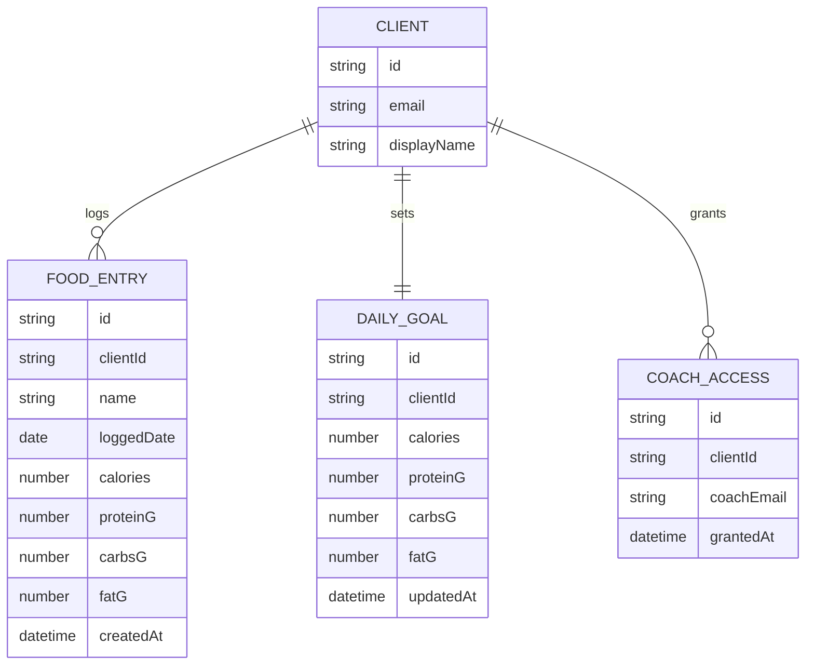

# Domain Model

Core entities for the macro tracker: a Client's food entries, their ongoing
daily goal, and the read-only access grants that let a Coach view a Client's
data.

- `CLIENT` is the signed-in user who owns their `FOOD_ENTRY` rows and one
ongoing `DAILY_GOAL`.
- `FOOD_ENTRY.loggedDate` groups entries by day for the daily/history views.
- `COACH_ACCESS` records that the Coach identified by `coachEmail` may read
this Client's entries and goal; a Coach's own account is matched to these
rows by their sign-in email at read time.

