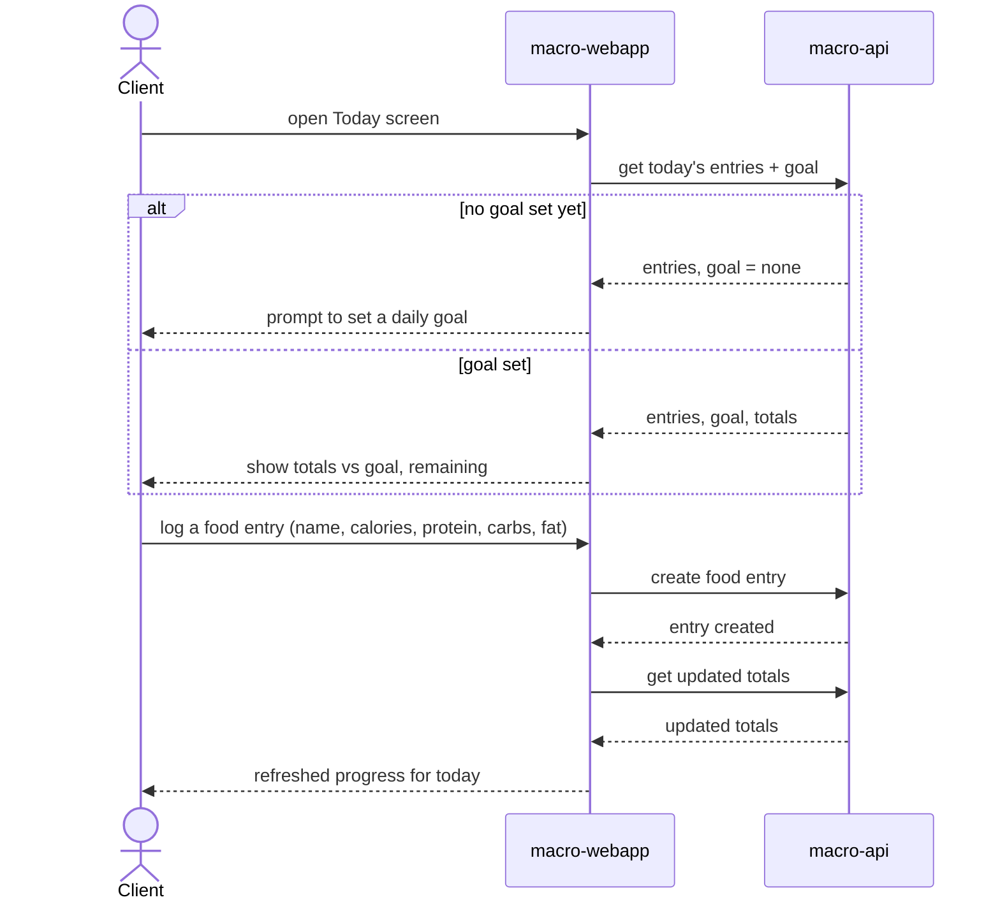

# Client logs food and sees progress against their goal

The Client records a food entry and checks how today's totals compare to
their ongoing daily goal.

```mermaid
sequenceDiagram
    actor Client
    participant macro-webapp
    participant macro-api

    Client->>macro-webapp: open Today screen
    macro-webapp->>macro-api: get today's entries + goal
    alt no goal set yet
        macro-api-->>macro-webapp: entries, goal = none
        macro-webapp-->>Client: prompt to set a daily goal
    else goal set
        macro-api-->>macro-webapp: entries, goal, totals
        macro-webapp-->>Client: show totals vs goal, remaining
    end
    Client->>macro-webapp: log a food entry (name, calories, protein, carbs, fat)
    macro-webapp->>macro-api: create food entry
    macro-api-->>macro-webapp: entry created
    macro-webapp->>macro-api: get updated totals
    macro-api-->>macro-webapp: updated totals
    macro-webapp-->>Client: refreshed progress for today
```

