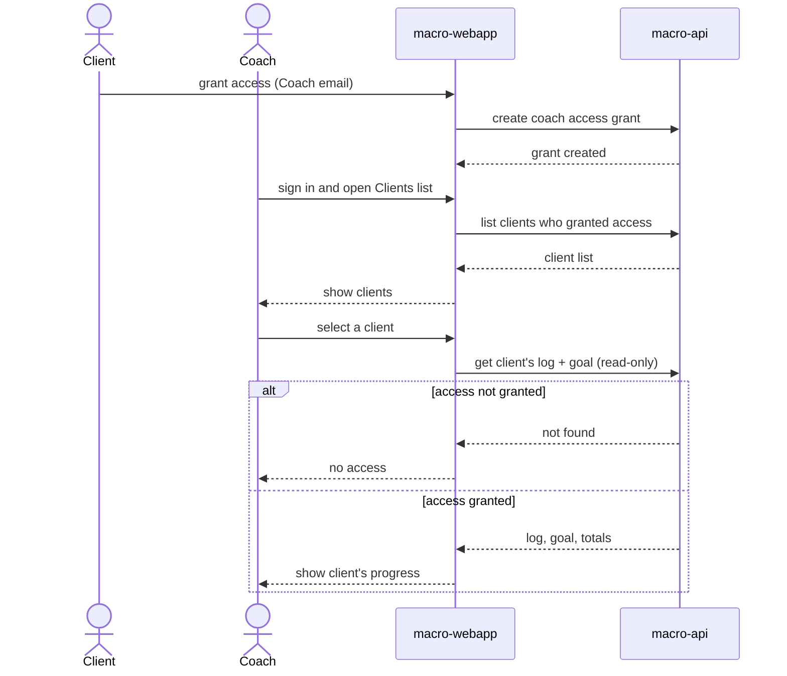

# Client grants access, Coach reviews progress

A Client grants a Coach read-only access to their log, and the Coach later
opens that Client's data.

```mermaid
sequenceDiagram
    actor Client
    actor Coach
    participant macro-webapp
    participant macro-api

    Client->>macro-webapp: grant access (Coach email)
    macro-webapp->>macro-api: create coach access grant
    macro-api-->>macro-webapp: grant created

    Coach->>macro-webapp: sign in and open Clients list
    macro-webapp->>macro-api: list clients who granted access
    macro-api-->>macro-webapp: client list
    macro-webapp-->>Coach: show clients
    Coach->>macro-webapp: select a client
    macro-webapp->>macro-api: get client's log + goal (read-only)
    alt access not granted
        macro-api-->>macro-webapp: not found
        macro-webapp-->>Coach: no access
    else access granted
        macro-api-->>macro-webapp: log, goal, totals
        macro-webapp-->>Coach: show client's progress
    end
```

